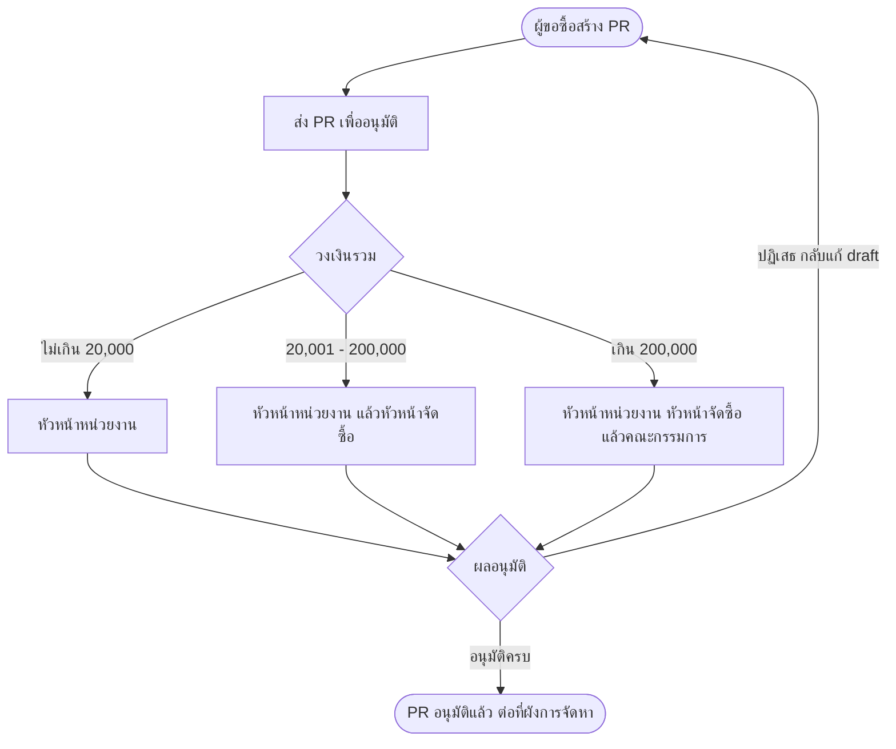

# จากการขอซื้อถึงผลอนุมัติ

```mermaid
flowchart TD
    A([ผู้ขอซื้อสร้าง PR]) --> B[ส่ง PR เพื่ออนุมัติ]
    B --> C{วงเงินรวม}
    C -->|ไม่เกิน 20,000| D1[หัวหน้าหน่วยงาน]
    C -->|20,001 - 200,000| D2[หัวหน้าหน่วยงาน แล้วหัวหน้าจัดซื้อ]
    C -->|เกิน 200,000| D3[หัวหน้าหน่วยงาน หัวหน้าจัดซื้อ แล้วคณะกรรมการ]
    D1 --> E{ผลอนุมัติ}
    D2 --> E
    D3 --> E
    E -->|ปฏิเสธ กลับแก้ draft| A
    E -->|อนุมัติครบ| F([PR อนุมัติแล้ว ต่อที่ผังการจัดหา])
```
