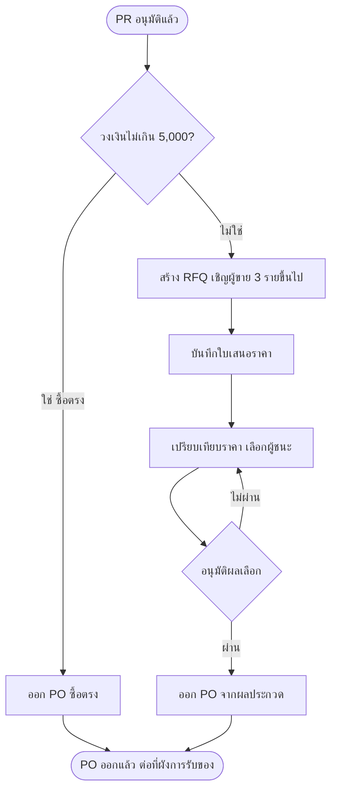

# จากการจัดหาถึงออกใบสั่งซื้อ

```mermaid
flowchart TD
    S([PR อนุมัติแล้ว]) --> F{วงเงินไม่เกิน 5,000?}
    F -->|ใช่ ซื้อตรง| H[ออก PO ซื้อตรง]
    F -->|ไม่ใช่| G[สร้าง RFQ เชิญผู้ขาย 3 รายขึ้นไป]
    G --> G2[บันทึกใบเสนอราคา]
    G2 --> G3[เปรียบเทียบราคา เลือกผู้ชนะ]
    G3 --> G4{อนุมัติผลเลือก}
    G4 -->|ไม่ผ่าน| G3
    G4 -->|ผ่าน| H2[ออก PO จากผลประกวด]
    H --> E([PO ออกแล้ว ต่อที่ผังการรับของ])
    H2 --> E
```
