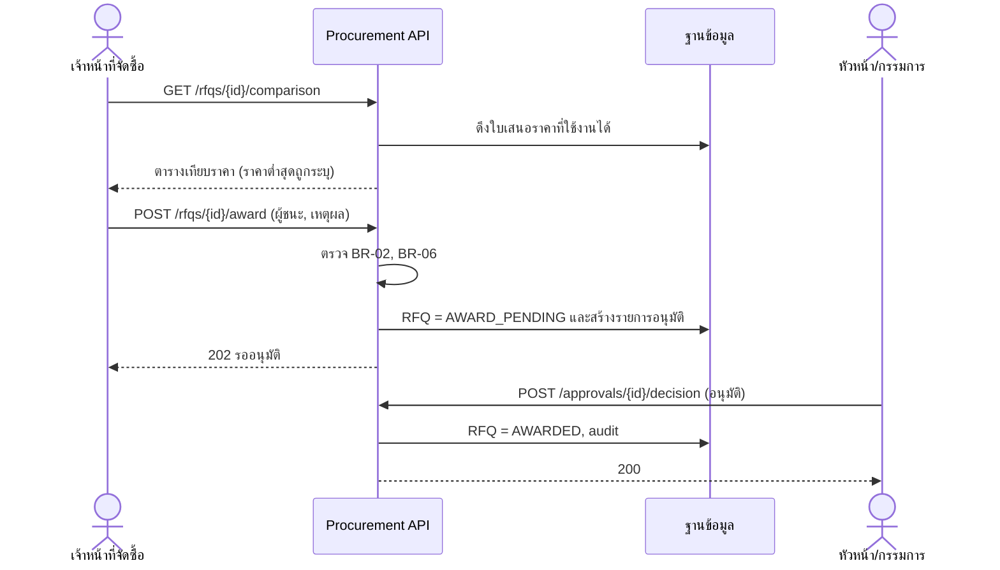

# เปรียบเทียบราคาและเลือกผู้ชนะ

```mermaid
sequenceDiagram
    actor P as เจ้าหน้าที่จัดซื้อ
    participant API as Procurement API
    participant DB as ฐานข้อมูล
    actor H as หัวหน้า/กรรมการ
    P->>API: GET /rfqs/{id}/comparison
    API->>DB: ดึงใบเสนอราคาที่ใช้งานได้
    API-->>P: ตารางเทียบราคา (ราคาต่ำสุดถูกระบุ)
    P->>API: POST /rfqs/{id}/award (ผู้ชนะ, เหตุผล)
    API->>API: ตรวจ BR-02, BR-06
    API->>DB: RFQ = AWARD_PENDING และสร้างรายการอนุมัติ
    API-->>P: 202 รออนุมัติ
    H->>API: POST /approvals/{id}/decision (อนุมัติ)
    API->>DB: RFQ = AWARDED, audit
    API-->>H: 200
```

**หมายเหตุ:** การอนุมัติ PR และการอนุมัติผลเลือกผู้ชนะใช้ endpoint กลางเดียวกัน (`/approvals`) แยกชนิดงานด้วยฟิลด์ `docType` (ดูเอกสาร API)
