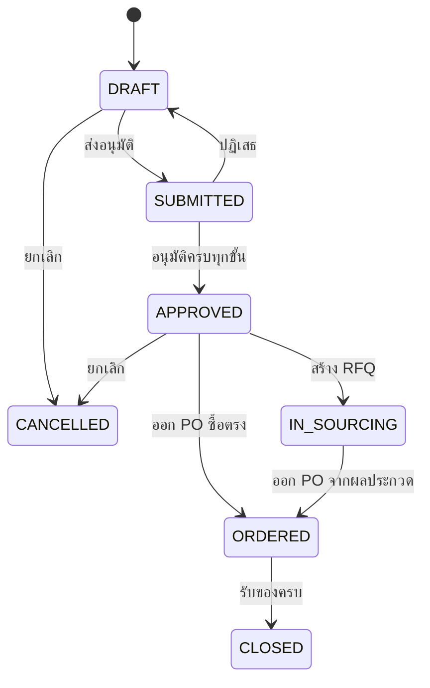

# สถานะใบขอซื้อ

```mermaid
stateDiagram-v2
    [*] --> DRAFT
    DRAFT --> SUBMITTED : ส่งอนุมัติ
    DRAFT --> CANCELLED : ยกเลิก
    SUBMITTED --> APPROVED : อนุมัติครบทุกขั้น
    SUBMITTED --> DRAFT : ปฏิเสธ
    APPROVED --> IN_SOURCING : สร้าง RFQ
    APPROVED --> ORDERED : ออก PO ซื้อตรง
    IN_SOURCING --> ORDERED : ออก PO จากผลประกวด
    ORDERED --> CLOSED : รับของครบ
    APPROVED --> CANCELLED : ยกเลิก
```
