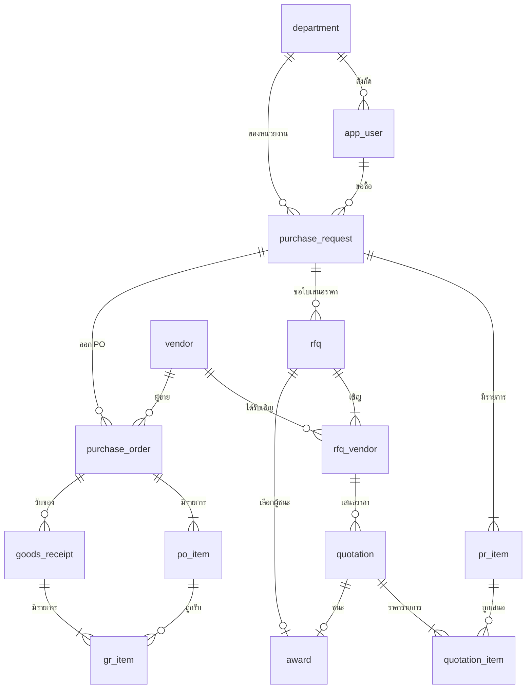

# แผนภาพความสัมพันธ์

```mermaid
erDiagram
    department ||--o{ app_user : "สังกัด"
    department ||--o{ purchase_request : "ของหน่วยงาน"
    app_user ||--o{ purchase_request : "ขอซื้อ"
    purchase_request ||--|{ pr_item : "มีรายการ"
    purchase_request ||--o{ rfq : "ขอใบเสนอราคา"
    rfq ||--|{ rfq_vendor : "เชิญ"
    vendor ||--o{ rfq_vendor : "ได้รับเชิญ"
    rfq_vendor ||--o{ quotation : "เสนอราคา"
    quotation ||--|{ quotation_item : "ราคารายการ"
    pr_item ||--o{ quotation_item : "ถูกเสนอ"
    rfq ||--o| award : "เลือกผู้ชนะ"
    quotation ||--o| award : "ชนะ"
    purchase_request ||--o{ purchase_order : "ออก PO"
    vendor ||--o{ purchase_order : "ผู้ขาย"
    purchase_order ||--|{ po_item : "มีรายการ"
    purchase_order ||--o{ goods_receipt : "รับของ"
    goods_receipt ||--|{ gr_item : "มีรายการ"
    po_item ||--o{ gr_item : "ถูกรับ"
```

ตาราง `approval`, `audit_log` และ `doc_sequence` ไม่ได้วาดความสัมพันธ์ เพราะอ้างเอกสารหลายชนิด (polymorphic) ตามเหตุผลในหัวข้อการตัดสินใจออกแบบ
