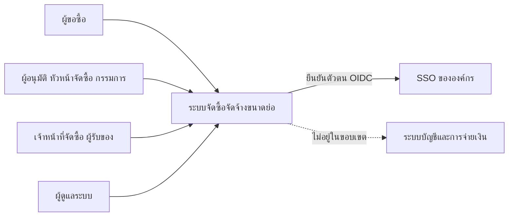

# บริบทของระบบ

```mermaid
flowchart LR
    U1[ผู้ขอซื้อ] --> S
    U2[ผู้อนุมัติ หัวหน้าจัดซื้อ กรรมการ] --> S
    U3[เจ้าหน้าที่จัดซื้อ ผู้รับของ] --> S
    U4[ผู้ดูแลระบบ] --> S
    S[ระบบจัดซื้อจัดจ้างขนาดย่อ] -->|ยืนยันตัวตน OIDC| IDP[SSO ขององค์กร]
    S -.ไม่อยู่ในขอบเขต.-> ERP[ระบบบัญชีและการจ่ายเงิน]
```
