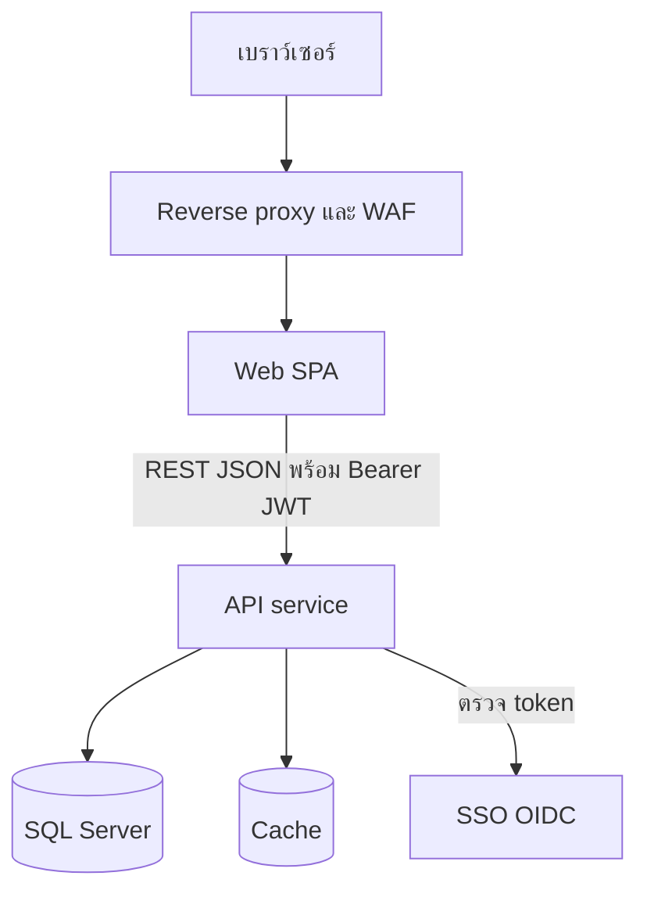

# หน่วยประกอบ

```mermaid
flowchart TD
    B[เบราว์เซอร์] --> P[Reverse proxy และ WAF]
    P --> W[Web SPA]
    W -->|REST JSON พร้อม Bearer JWT| A[API service]
    A --> D[(SQL Server)]
    A --> C[(Cache)]
    A -->|ตรวจ token| I[SSO OIDC]
```
