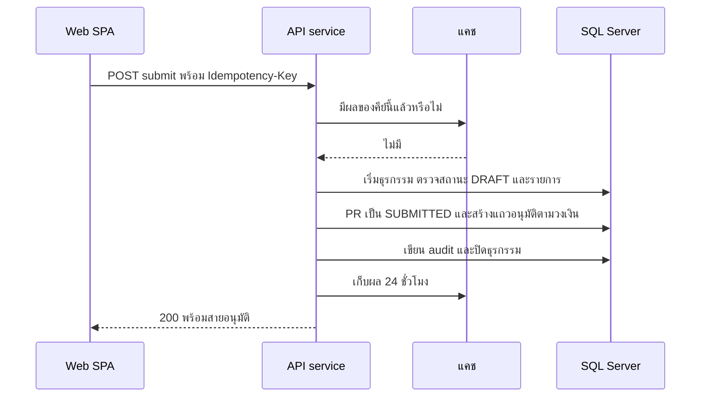

# ส่งใบขอซื้อเพื่ออนุมัติ

```mermaid
sequenceDiagram
    participant W as Web SPA
    participant A as API service
    participant C as แคช
    participant D as SQL Server
    W->>A: POST submit พร้อม Idempotency-Key
    A->>C: มีผลของคีย์นี้แล้วหรือไม่
    C-->>A: ไม่มี
    A->>D: เริ่มธุรกรรม ตรวจสถานะ DRAFT และรายการ
    A->>D: PR เป็น SUBMITTED และสร้างแถวอนุมัติตามวงเงิน
    A->>D: เขียน audit และปิดธุรกรรม
    A->>C: เก็บผล 24 ชั่วโมง
    A-->>W: 200 พร้อมสายอนุมัติ
```
