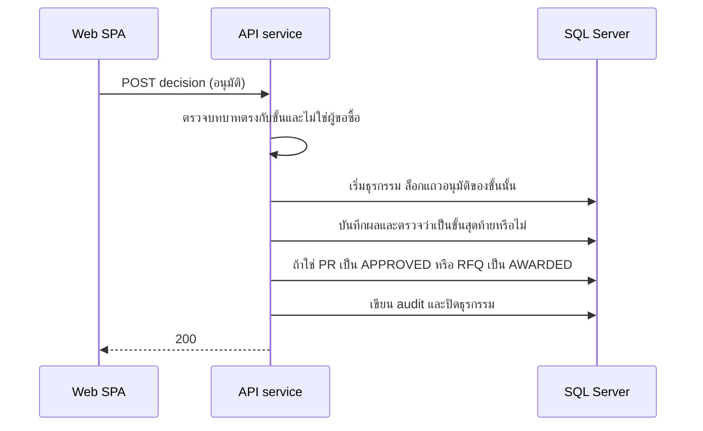

# อนุมัติขั้นสุดท้าย

```mermaid
sequenceDiagram
    participant W as Web SPA
    participant A as API service
    participant D as SQL Server
    W->>A: POST decision (อนุมัติ)
    A->>A: ตรวจบทบาทตรงกับขั้นและไม่ใช่ผู้ขอซื้อ
    A->>D: เริ่มธุรกรรม ล็อกแถวอนุมัติของขั้นนั้น
    A->>D: บันทึกผลและตรวจว่าเป็นขั้นสุดท้ายหรือไม่
    A->>D: ถ้าใช่ PR เป็น APPROVED หรือ RFQ เป็น AWARDED
    A->>D: เขียน audit และปิดธุรกรรม
    A-->>W: 200
```
