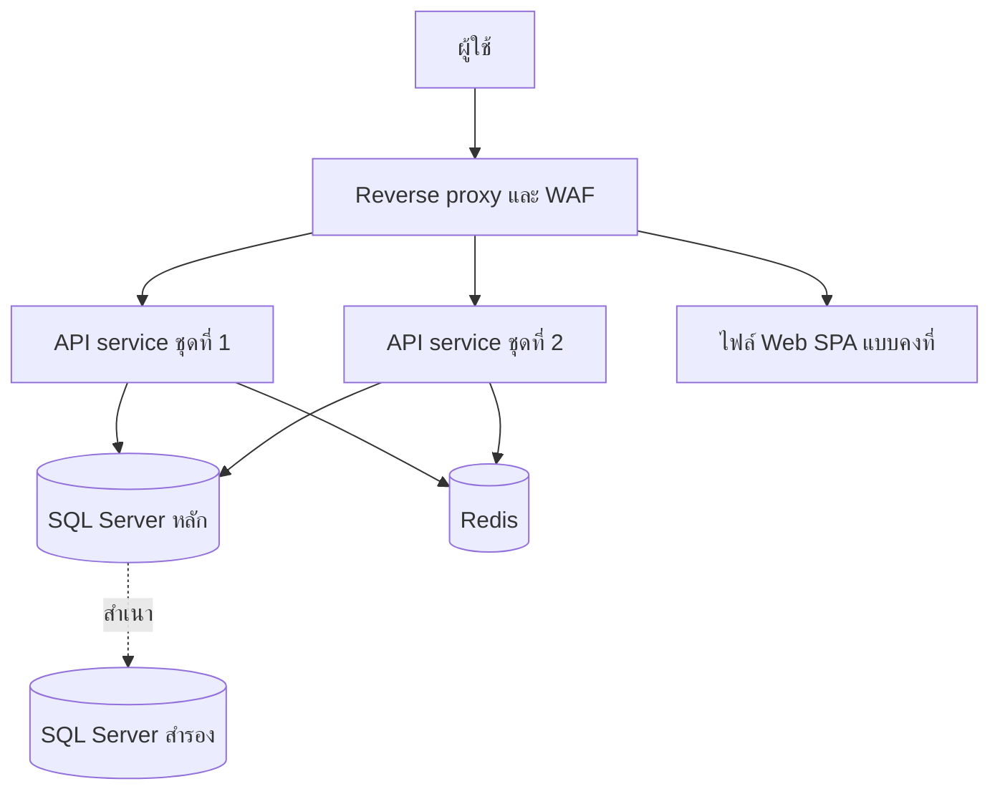

# การติดตั้ง

```mermaid
flowchart TD
    U[ผู้ใช้] --> WAF[Reverse proxy และ WAF]
    WAF --> A1[API service ชุดที่ 1]
    WAF --> A2[API service ชุดที่ 2]
    WAF --> ST[ไฟล์ Web SPA แบบคงที่]
    A1 --> DB[(SQL Server หลัก)]
    A2 --> DB
    DB -.สำเนา.-> DR[(SQL Server สำรอง)]
    A1 --> R[(Redis)]
    A2 --> R
```
