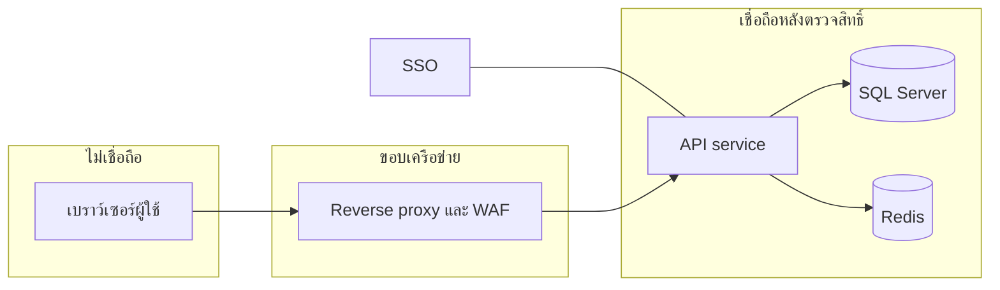

# ขอบเขตความเชื่อถือ

```mermaid
flowchart LR
    subgraph ภายนอก[ไม่เชื่อถือ]
        B[เบราว์เซอร์ผู้ใช้]
    end
    subgraph ขอบ[ขอบเครือข่าย]
        P[Reverse proxy และ WAF]
    end
    subgraph ภายใน[เชื่อถือหลังตรวจสิทธิ์]
        A[API service]
        D[(SQL Server)]
        C[(Redis)]
    end
    I[SSO] --- A
    B --> P --> A
    A --> D
    A --> C
```
